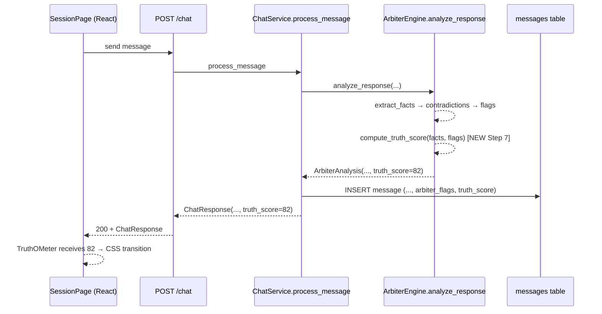

# SPEC: GH-8 — Truth-O-Meter UI (Animated SVG Gauge for Arbiter Confidence)

**Task:** GH-8 — Truth-O-Meter UI — animated SVG gauge, 0-100% mapped to Arbiter confidence score, R&M label scale
**Date:** 2026-04-29
**Author:** Drew Schillinger (via Spec Writer Agent)
**Status:** Draft
**Mode:** Story (forced — multi-file feature with shared contract changes)

---

## Problem

The Arbiter agent already analyzes every witness response and emits structured `arbiter_flags` (contradiction / unsupported / vague) plus per-fact confidence categories (`certain` / `uncertain` / `estimate` / `dont_recall`). Today these signals are surfaced as a small list of badges per message — useful for a careful reader, useless for a stage demo or a quick credibility read.

Demo audiences and operators need a single, glanceable, animated indicator that summarizes the latest witness response's overall trustworthiness on a 0-100 scale, themed in the Rick & Morty visual language the project is migrating to (GH-9). The gauge must visibly swing when a new Arbiter analysis lands, persist across page refreshes, and remain hookable for a future demo-presenter "inject wrong answer" flag (GH-6) without coupling to it now.

Affected surface: the `SessionPage` chat experience used by every operator running a deposition session. `ClerkPage` is explicitly out of scope for v1.

## Technical Constraints

- **Backend stack:** FastAPI + SQLAlchemy ORM (raw SQL migrations under `migrations/`, e.g. `001_add_witness_profiles.sql` — **not** Alembic). New columns ship as a new numbered `.sql` file.
- **`ArbiterAnalysis`** is a plain Python class (not Pydantic) at `app/agents/arbiter.py:20-31`. New field `truth_score: int` is added there as a regular attribute with a default.
- **`ChatResponse` and `MessageResponse`** are Pydantic models at `app/schemas/chat.py:33-39` and `app/schemas/chat.py:42-52`. New field `truth_score: int` (non-optional on `ChatResponse` since it is computed every turn; nullable on `MessageResponse` only for historical rows that pre-date the column).
- **`Message` ORM model** at `app/db/models.py:124-138` already stores `arbiter_flags` as JSONB. Add a new column `truth_score` (integer, nullable) alongside it.
- **No new frontend dependency.** `frontend/package.json:11-22` shows React 18.3, react-router-dom 7, @tanstack/react-query 5, lucide-react, react-dom — no SVG / charting / animation library installed. The gauge is hand-rolled SVG with CSS transitions.
- **Tailwind tokens only.** Existing tokens in `frontend/tailwind.config.js:7-17` (`legal-navy`, `legal-gold`, `coach-green`, `defense-red`) plus the standard palette. New gauge zone colors must come from the theme so GH-9 (R&M re-skin) can swap them without editing `TruthOMeter.tsx`.
- **Score derivation must be deterministic and cheap.** No new LLM call. Pure compute over `ArbiterAnalysis.flags` and `ArbiterAnalysis.extracted_facts` — same inputs `_generate_flags` already inspects (`app/agents/arbiter.py:215-257`).
- **Backwards compatibility:** existing `arbiter_flags` rendering at `frontend/src/pages/SessionPage.tsx:362-368` and the `FlagBadge` color map at `frontend/src/pages/SessionPage.tsx:385-399` must keep working unchanged — the gauge is an aggregate sibling, not a replacement.
- **Animation budget:** 60fps SVG transitions, 1.0–1.5s ease so the swing is visible during a stage demo but not sluggish. CSS `transition` on the needle's `transform: rotate(...)` (and the arc stroke offset) is sufficient.
- **Persistence:** `truth_score` is persisted on the `Message` row so a session refresh shows the latest computed value, not a 100% default.
- **Hookable for GH-6 (demo presenter):** `truth_score` is a plain field on `ArbiterAnalysis` and `ChatResponse` — when GH-6 lands, the demo flag `inject_wrong_answer` will simply override the score (e.g. clamp to a low zone). No special wiring needed in this ticket beyond keeping the field a single integer that any later layer can rewrite.

## Solution

### Approach

Add one integer field — `truth_score` — to the Arbiter's output, persist it on the `Message` row via a new SQL migration, surface it through both `ChatResponse` and `MessageResponse`, and render it in a new hand-rolled SVG component (`TruthOMeter.tsx`) mounted at the top of `SessionPage`. The score is a deterministic function of existing Arbiter outputs: start at 100, subtract penalties for each contradiction flag, unsupported flag, `dont_recall` fact, and `uncertain`/`estimate` fact, clamp to `[0, 100]`. Five R&M-themed zones map score ranges to a label and a Tailwind color token. Animation is pure CSS transition on the needle's rotation.

### Design

#### Data flow



#### Score derivation (deterministic, no LLM)

Add a new pure function `_compute_truth_score(facts, flags) -> int` in `app/agents/arbiter.py`, called as Step 7 of `analyze_response` (`app/agents/arbiter.py:49-79`) immediately before constructing the returned `ArbiterAnalysis`.

Starting baseline and penalties (locked, may be tuned in follow-up tickets):

| Input | Penalty per occurrence |
|-------|-----------------------|
| `flag.flag_type == "contradiction"` | -15 |
| `flag.flag_type == "unsupported"` | -8 |
| `fact.confidence == "dont_recall"` | -5 |
| `fact.confidence == "uncertain"` | -3 |
| `fact.confidence == "estimate"` | -3 |
| `fact.confidence == "certain"` | 0 |

Algorithm:

```python
def _compute_truth_score(facts: list[dict], flags: list[ArbiterFlag]) -> int:
    score = 100
    for f in flags:
        if f.flag_type == "contradiction":
            score -= 15
        elif f.flag_type == "unsupported":
            score -= 8
    for fact in facts:
        c = fact.get("confidence")
        if c == "dont_recall":
            score -= 5
        elif c in ("uncertain", "estimate"):
            score -= 3
    return max(0, min(100, score))
```

`vague` flags are intentionally **not** penalized in v1 — vagueness is captured indirectly via the `uncertain` / `estimate` per-fact confidence. The `risk` flag type declared at `app/schemas/chat.py:18-23` is also not penalized because the current arbiter never emits it (verified: `_generate_flags` at `app/agents/arbiter.py:215-257` only emits `contradiction`, `unsupported`, `vague`).

> NOTE: open question — penalty weights are best-guess starting points. Acceptance tests below pin specific input → output cases, but the engineer may want to tune weights after watching it on real sessions. A follow-up ticket can adjust without changing the schema.

#### R&M-themed zone scale

| Score range | Zone label | Meaning (tooltip / aria) | Tailwind color token |
|---|---|---|---|
| 0-19 | **Cronenberg-Level Nonsense** | Probably mutated garbage. Do not trust it unless you enjoy lawsuits and body horror. | `defense-red` |
| 20-39 | **Jerry-Level Confidence** | Sounds confident. Unfortunately, so does Jerry. Needs serious verification. | `legal-gold` (interim — GH-9 swaps to a portal-orange token) |
| 40-59 | **Aw Jeez, Maybe?** | Plausible, but shaky. The Morty zone. Ask for citations. | `legal-gold` |
| 60-79 | **Council-Approved-ish** | Pretty solid. Still needs a quick sanity check before anyone gets smug. | `coach-green` |
| 80-100 | **C-137 Canon Event** | Strongly supported. Across most timelines, this holds up. | `coach-green` |

Zones are exported from `TruthOMeter.tsx` as a typed `const DEFAULT_ZONES` array (each entry: `{ label, meaning, min, max, colorClass }`) so GH-9 can replace the color tokens and GH-6 can override label copy without touching component logic. The `meaning` string is rendered as a `<title>` tooltip on the gauge SVG and used in the `aria-label`.

#### Schema changes

**Backend Pydantic** (`app/schemas/chat.py`):

```diff
 class ChatResponse(BaseModel):
     agent_message: str
     citations: list[Citation]
     arbiter_flags: list[ArbiterFlag]
     new_facts: list[UUID]
+    truth_score: int  # 0-100, computed deterministically by arbiter

 class MessageResponse(BaseModel):
     id: UUID
     role: str
     content: str
     citations: list[Citation]
     arbiter_flags: list[ArbiterFlag]
+    truth_score: int | None  # null for messages persisted before this column
     created_at: str
```

**Backend ORM** (`app/db/models.py:124-138`) — note: existing model uses SQLAlchemy 2.0 `Mapped[]` / `mapped_column` syntax with `default=datetime.utcnow`, NOT the legacy `Column()` API. New column follows the same pattern:

```diff
 class Message(Base):
     __tablename__ = "messages"
     ...
     citations: Mapped[list[Any]] = mapped_column(JSONB, default=list)
     arbiter_flags: Mapped[list[Any]] = mapped_column(JSONB, default=list)
+    truth_score: Mapped[int | None] = mapped_column(Integer, nullable=True, default=None)
     created_at: Mapped[datetime] = mapped_column(DateTime, default=datetime.utcnow)
```

Required imports (already present in `app/db/models.py`): `Integer` from `sqlalchemy`, `Mapped` and `mapped_column` from `sqlalchemy.orm`.

**Migration** (`migrations/00X_add_message_truth_score.sql` — pick the next available `00X` after inspecting the dir):

```sql
ALTER TABLE messages
    ADD COLUMN IF NOT EXISTS truth_score INTEGER NULL;
```

Nullable on purpose — historical rows do not get back-filled. The frontend renders `null` as a neutral "no score yet" state (gauge at 100% / hidden — see component spec below).

**Frontend types** (`frontend/src/types/index.ts`):

```diff
 export interface Message {
   id: string
   role: 'agent' | 'witness' | 'arbiter'
   content: string
   citations: Citation[]
   arbiter_flags: ArbiterFlag[]
+  truth_score: number | null
   created_at: string
 }

 export interface ChatResponse {
   agent_message: string
   citations: Citation[]
   arbiter_flags: ArbiterFlag[]
   new_facts: string[]
+  truth_score: number
 }
```

#### Component contract — `TruthOMeter.tsx`

```ts
type TruthZone = {
  label: string;
  min: number;        // inclusive
  max: number;        // inclusive
  colorClass: string; // Tailwind text/stroke/fill class, e.g. "text-coach-green"
};

interface TruthOMeterProps {
  score: number | null;          // 0..100 or null = neutral idle
  className?: string;            // for caller-driven layout
  durationMs?: number;           // default 1200, swing time
  zones?: TruthZone[];           // default exported R&M scale, overridable for GH-9 / GH-6
}
```

Visual contract:

- 180° semicircular SVG arc, fixed `viewBox`, scales with `className`.
- Background arc at 30% opacity in the current zone color.
- Foreground arc stroke length = `(score / 100) * arcLength` (uses `stroke-dasharray` + `stroke-dashoffset` with CSS `transition`).
- Needle is an SVG `<line>` whose rotation transform = `score * 1.8 - 90` degrees (0→-90°, 100→+90°). CSS `transition: transform <durationMs>ms cubic-bezier(0.4, 0, 0.2, 1)` for the swing.
- Numeric score and zone label rendered below the arc.
- When `score === null`: needle parked at the 100 position with `aria-hidden`-ish neutral styling, no zone label rendered.
- Accessibility: `role="img"` with `aria-label={\`Truth-O-Meter: ${score} out of 100, ${zoneLabel}\`}`.

Mounting site in `SessionPage.tsx`: rendered above the message list, fed from the latest `agent`-role message's `truth_score`. The data-flow rationale: arbiter analysis runs against the witness response, but the resulting `arbiter_flags` (and therefore the new `truth_score`) are persisted on the *agent* `Message` row that follows it (`app/services/chat.py:104` — `arbiter_flags=[f.model_dump(...) for f in arbiter_result.flags]` lives on `agent_msg`, not the witness msg). The gauge follows that same row so a single source of truth drives both badges and gauge. When a new `ChatResponse` arrives, React re-renders with the new score and CSS handles the swing.

### Files to Change

| File | Change | Why |
|------|--------|-----|
| `app/agents/arbiter.py` | Add `truth_score: int` to `ArbiterAnalysis`; add `_compute_truth_score(facts, flags)`; call as Step 7 inside `analyze_response`. | Source of truth for the score. Pure compute on existing inputs. |
| `app/schemas/chat.py` | Add `truth_score: int` to `ChatResponse`; add `truth_score: int \| None` to `MessageResponse`. | Contract surface for the frontend. |
| `app/db/models.py` | Add `truth_score: Mapped[int \| None] = mapped_column(Integer, nullable=True, default=None)` to `Message` (matches existing SQLAlchemy 2.0 syntax). | Persist per-message so refresh shows correct gauge. |
| `app/services/chat.py` | When persisting Message in `process_message`, write `truth_score=arbiter_result.truth_score`; include `truth_score=arbiter_result.truth_score` in returned `ChatResponse`. | Propagate score from Arbiter → DB → API. |
| `app/api/routes/chat.py` | In `get_messages_route`, map `truth_score=msg.truth_score` when building each `MessageResponse`. | Restore gauge state on session refresh. |
| `migrations/00X_add_message_truth_score.sql` | NEW. `ALTER TABLE messages ADD COLUMN truth_score INTEGER NULL;` | Database column. Nullable so old rows survive. Project uses raw SQL files, not Alembic. |
| `frontend/src/types/index.ts` | Add `truth_score: number \| null` to `Message`; add `truth_score: number` to `ChatResponse`. | Type-safe consumption. |
| `frontend/src/components/TruthOMeter.tsx` | NEW component — SVG gauge described above. Exports default component plus `DEFAULT_ZONES` const for GH-9 / GH-6 to override. | The visual itself. |
| `frontend/src/pages/SessionPage.tsx` | Import `TruthOMeter`; render it above the message list, fed from `latestAssistantMessage?.truth_score ?? null`. | Mount the gauge. Existing `arbiter_flags` rendering at lines 362-368 and `FlagBadge` at 385-399 are left untouched. |

### What This Does NOT Change

- `ClerkPage.tsx` — no gauge there in v1. ClerkPage continues its read-only `arbiter_flags` display unchanged.
- The per-message `arbiter_flags` badge rendering (`frontend/src/pages/SessionPage.tsx:362-399`). The gauge is additive.
- The Arbiter's existing flag generation (`app/agents/arbiter.py:215-257`). No new flag types, no LLM prompt changes.
- The R&M visual theme work (GH-9). This ticket uses **existing** Tailwind tokens (`coach-green`, `legal-gold`, `defense-red`); GH-9 will introduce portal-themed tokens and swap them in.
- The demo presenter `inject_wrong_answer` flag (GH-6). This ticket leaves `truth_score` a single integer that GH-6 can override; no demo-presenter logic ships here.
- Any back-fill of `truth_score` for historical messages — they stay `NULL` and render as "no score yet".

## Acceptance Criteria

1. **GIVEN** a witness response with no contradictions, no unsupported flags, and all facts marked `certain` **WHEN** `ArbiterEngine.analyze_response` returns **THEN** `analysis.truth_score == 100`.

2. **GIVEN** a witness response that produces 1 `contradiction` flag, 1 `unsupported` flag, and 2 facts with confidence `dont_recall` **WHEN** `_compute_truth_score` is invoked **THEN** it returns `100 - 15 - 8 - 5 - 5 = 67`.

3. **GIVEN** a pathologically bad response producing 10 contradictions **WHEN** `_compute_truth_score` is invoked **THEN** it returns `0` (clamp floor honored — never negative).

4. **GIVEN** a chat turn completes successfully **WHEN** the `POST /chat` response is inspected **THEN** the JSON body includes a `truth_score` integer field in `[0, 100]`.

5. **GIVEN** a message has been persisted with `truth_score=42` **WHEN** the user refreshes the page and `GET /sessions/{id}/messages` is called **THEN** the response includes that message with `truth_score: 42` (not `null`, not 100).

6. **GIVEN** a message persisted before the migration ran (no `truth_score` column value) **WHEN** `GET /sessions/{id}/messages` is called **THEN** the response includes that message with `truth_score: null` and the frontend renders the gauge in its neutral idle state.

7. **GIVEN** the `SessionPage` is rendered with at least one `agent`-role message that has a non-null `truth_score` **WHEN** the page mounts **THEN** the `TruthOMeter` SVG is visible above the message list and its needle is positioned at the corresponding angle (0 → -90°, 100 → +90°).

8. **GIVEN** the `TruthOMeter` is showing score `85` **WHEN** a new `agent`-role message arrives with `truth_score: 30` **THEN** the needle visibly animates from the 85 position to the 30 position over ~1.0–1.5 seconds (CSS transition on `transform` confirmed in DevTools).

9. **GIVEN** the score is `15` **WHEN** the gauge renders **THEN** the displayed zone label is `"Cronenberg-Level Nonsense"` and the foreground arc / needle uses the `defense-red` Tailwind token.

10. **GIVEN** the score is `92` **WHEN** the gauge renders **THEN** the displayed zone label is `"C-137 Canon Event"` and the foreground arc / needle uses the `coach-green` Tailwind token.

11. **GIVEN** the `TruthOMeter` is rendered with `score={null}` **WHEN** a screen reader inspects the component **THEN** it has `role="img"` and an `aria-label` indicating no current score (e.g. `"Truth-O-Meter: no score yet"`).

12. **GIVEN** the existing `arbiter_flags` rendering at `SessionPage.tsx:362-368` and `FlagBadge` color map at `385-399` **WHEN** the Truth-O-Meter ships **THEN** those code paths render identically to before — no removed badges, no changed colors. (Visual regression check.)

13. **GIVEN** the SQL migration is applied to a database that already has rows in `messages` **WHEN** the migration runs **THEN** it completes without error and existing rows have `truth_score IS NULL`.

## Risks

| Risk | Likelihood | Impact | Mitigation |
|------|-----------|--------|------------|
| Penalty weights produce a gauge that always reads 90+ on real sessions, killing demo drama | Med | Med | AC tests pin specific weights now; tune in a follow-up after first live demo. Weights are isolated in `_compute_truth_score`. |
| CSS transition on `transform: rotate` jitters on Safari | Low | Low | Use `cubic-bezier` with `will-change: transform` if measured. Verified manually in /drew-qa step. |
| Old messages render as 100% by accident, masking real data quality | Med | High | Frontend treats `null` as a distinct neutral state, NOT 100. AC #6 + #11 enforce this. |
| Migration filename collision with another in-flight ticket | Low | Med | Pick `00X` by reading `migrations/` at implementation time, not now. |
| `ArbiterAnalysis` is a plain class so adding a field with a default is safe; if it gets converted to `dataclass` / Pydantic later, default behavior could change | Low | Low | Document `truth_score` with explicit default `100` in the class definition. Tested by AC #1. |
| GH-9 (R&M re-skin) ends up wanting a different label scale (e.g. licensing concerns over Roiland-isms) | Med | Low | Zones are a prop with an exported default — GH-9 swaps the array, no component edits needed. |
| GH-6 (demo presenter) needs to inject a forced low score mid-session | Low | Low | `truth_score` is a plain integer field on `ArbiterAnalysis` / `ChatResponse`; GH-6 overrides at the service layer. No coupling here. |

## Dependencies

- [ ] External: none.
- [ ] Internal: none blocking. Related (sibling) tickets: **GH-9** (R&M visual theme — must accept the same Tailwind token surface this gauge uses); **GH-6** (Demo presenter mode — will hook the `truth_score` field downstream of this ticket). Neither blocks GH-8.

## Test Plan

**Unit tests (backend, pytest):**
- `_compute_truth_score` with empty inputs → 100.
- `_compute_truth_score` with one of each penalty type → exact arithmetic match (covers AC #2).
- `_compute_truth_score` clamping at 0 and 100 (covers AC #3).
- Integration: invoke `ArbiterEngine.analyze_response` against a mocked LLM that returns canned facts + flags → assert `truth_score` matches the formula.

**Integration tests (backend, pytest + httpx):**
- `POST /chat` returns a body containing `truth_score: int` (covers AC #4).
- `GET /sessions/{id}/messages` after a chat turn returns the message with the same `truth_score` value (covers AC #5).
- `GET /sessions/{id}/messages` against a row with `truth_score IS NULL` returns `truth_score: null` (covers AC #6).

**Migration test:**
- Apply `00X_add_message_truth_score.sql` to a fresh + a populated DB; verify column exists and existing rows are NULL (covers AC #13).

**Frontend (manual + Playwright/equivalent if available):**
- Mount `TruthOMeter` in isolation with `score=0`, `score=50`, `score=100`, `score=null` — verify zone label, color, and aria-label (covers AC #9, #10, #11).
- In `SessionPage`, send two messages where the second produces a much lower score; visually confirm needle animates (covers AC #7, #8).
- DevTools inspector confirms `transform: rotate(...)` and `transition` are set (covers AC #8).

**Manual visual regression:**
- Compare `SessionPage` arbiter_flags rendering before/after on the same session — must be identical (covers AC #12).

## Model Router

**Decision:** **Opus / Enterprise Architect**

Apply the decision tree to the "Files to Change" table above:

| Signal | Value | Verdict |
|--------|-------|---------|
| Files changed | 9 (5 backend Python, 1 SQL migration, 3 frontend TS/TSX) | ≥ 3 → **Opus** |
| Modules spanned | 4 top-level dirs (`app/`, `migrations/`, `frontend/src/components/`, `frontend/src/pages/` — counting `frontend/src/*` as one module: still 3: `app/`, `migrations/`, `frontend/`) | ≥ 2 → **Opus** |
| Architecture or design decision? | Yes — penalty-weight algorithm, R&M zone scale, gauge component contract, hookability for GH-6/GH-9 | Yes → **Opus** |
| Shared contract change? (API, DTO, webhook, SP) | Yes — `ChatResponse`, `MessageResponse`, `Message` ORM, `messages` table schema, `frontend/src/types/index.ts` | Yes → **Opus** |
| Failed fix attempts? | N/A (greenfield) | N/A |

**Escalate to Opus / Enterprise Architect if:** any of the above signals re-confirm at implementation time, **or** if `_compute_truth_score` weights need to be re-tuned and the engineer wants the design rationale documented inline, **or** if `ArbiterAnalysis` is mid-migration to Pydantic/dataclass during implementation (then a structural decision is required).

> Sub-agent note: this ticket is bounded — under 10 files, all under 200 lines of net new code expected. No condensing script needed.

## Sources

Every factual claim above traces to at least one entry below. Branch: `main`, commit: `7d52b82`.

- `app/agents/arbiter.py:20-31` (branch: main, commit: 7d52b82) — confirms `ArbiterAnalysis` is a plain Python class with `extracted_facts: list[dict]`, `flags: list[ArbiterFlag]`, `suggested_followups: list[str]`; this is where `truth_score: int` is added.
- `app/agents/arbiter.py:49-79` (branch: main, commit: 7d52b82) — confirms `ArbiterEngine.analyze_response` is async, returns `ArbiterAnalysis`, runs a six-step pipeline; `_compute_truth_score` is added as Step 7 immediately before return.
- `app/agents/arbiter.py:215-257` (branch: main, commit: 7d52b82) — confirms `_generate_flags` emits exactly `contradiction`, `unsupported`, `vague` flag types; the score function inspects the same inputs and explains why `risk` is unweighted.
- `app/agents/arbiter.py:101` (branch: main, commit: 7d52b82) — confirms the LLM-prompt confidence enum is exactly `certain | uncertain | estimate | dont_recall`; same enum echoed in `frontend/src/types/index.ts:74` (`FactEntry.confidence`). These are the only confidence values the score function inspects.
- `app/schemas/chat.py:18-23` (branch: main, commit: 7d52b82) — confirms `ArbiterFlag` is a Pydantic `BaseModel` with `flag_type: Literal['contradiction','unsupported','vague','risk']`; `risk` is declared but never emitted (cross-checked with `arbiter.py:215-257`), justifying its omission from the penalty table.
- `app/schemas/chat.py:33-39` (branch: main, commit: 7d52b82) — confirms `ChatResponse` shape (`agent_message`, `citations`, `arbiter_flags`, `new_facts`); `truth_score: int` is added here.
- `app/schemas/chat.py:42-52` (branch: main, commit: 7d52b82) — confirms `MessageResponse` shape (`id`, `role`, `content`, `citations`, `arbiter_flags`, `created_at`); `truth_score: int | None` is added here.
- `app/db/models.py:124-138` (branch: main, commit: 7d52b82) — confirms `Message` ORM model uses SQLAlchemy 2.0 `Mapped[]` / `mapped_column` syntax (e.g. `arbiter_flags: Mapped[list[Any]] = mapped_column(JSONB, default=list)`, `created_at: Mapped[datetime] = mapped_column(DateTime, default=datetime.utcnow)`); new `truth_score: Mapped[int | None] = mapped_column(Integer, nullable=True, default=None)` follows the same pattern.
- `app/services/chat.py:59-116` (branch: main, commit: 7d52b82) — confirms `ChatService.process_message` calls `arbiter.analyze_response` (line 59), persists `arbiter_flags` to the Message row (line 104), and returns `ChatResponse` with `arbiter_flags` (lines 111-116). `truth_score` flows through the same path.
- `app/api/routes/chat.py:17-47` (branch: main, commit: 7d52b82) — confirms `POST /chat` endpoint returns `ChatService.process_message` output unchanged; `truth_score` flows through automatically once added to `ChatResponse`.
- `app/api/routes/chat.py:50-81` (branch: main, commit: 7d52b82) — confirms `GET /sessions/{id}/messages` maps Message ORM rows to `MessageResponse`; mapping must add `truth_score=msg.truth_score` (around line 77).
- `frontend/src/types/index.ts:10-14` (branch: main, commit: 7d52b82) — confirms TypeScript `ArbiterFlag` interface mirrors the backend `flag_type` union of four literals; gauge does not change this.
- `frontend/src/types/index.ts:16-23` (branch: main, commit: 7d52b82) — confirms current `Message` interface lacks `truth_score`; spec adds `truth_score: number | null`.
- `frontend/src/types/index.ts:87-92` (branch: main, commit: 7d52b82) — confirms current `ChatResponse` interface; spec adds `truth_score: number`.
- `frontend/src/pages/SessionPage.tsx:362-368` (branch: main, commit: 7d52b82) — confirms where `arbiter_flags` are mapped per message; Truth-O-Meter is a sibling above the message list, NOT a replacement.
- `frontend/src/pages/SessionPage.tsx:385-399` (branch: main, commit: 7d52b82) — confirms `FlagBadge` per-flag rendering with `AlertTriangle` icon and existing color map (red/yellow/orange/purple); this component is untouched.
- `frontend/src/pages/SessionPage.tsx:386-391` (branch: main, commit: 7d52b82) — confirms existing `FlagBadge` color map; gauge color thresholds use a different mapping (green→yellow→red across 0-100), justifying a separate constant.
- `frontend/tailwind.config.js:7-17` (branch: main, commit: 7d52b82) — confirms existing custom Tailwind tokens (`legal-navy #1a365d`, `legal-gold #b7791f`, `coach-green #276749`, `defense-red #9b2c2c`); gauge uses these so GH-9 can swap tokens without component edits.
- `frontend/package.json:11-22` (branch: main, commit: 7d52b82) — confirms NO SVG / charting / animation library is installed (only React 18.3, react-router-dom 7, @tanstack/react-query 5, lucide-react, react-dom); gauge must be hand-rolled SVG with CSS transitions, no new dependency.
- `migrations/` (branch: main, commit: 7d52b82) — confirms the migrations directory exists and uses raw numbered `.sql` files (e.g. `001_add_witness_profiles.sql`); a new `00X_add_message_truth_score.sql` follows that convention. Project does NOT use Alembic.